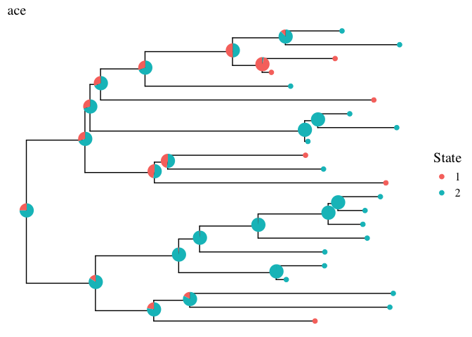
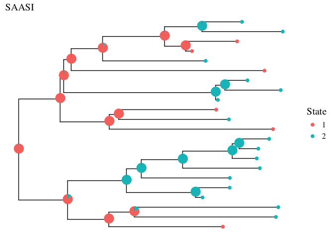

<!-- README.md is generated from README.Rmd. Please edit that file -->

# Sampling Aware Ancestral State Inference (saasi)

<!-- badges: start -->
<!-- badges: end -->

Saasi is an ancestral state reconstruction method that accounts for
variation in sampling rates among locations or traits.

## Installation

You can install the development version of saasi from
[GitHub](https://github.com/) with:

     # install.packages("remotes")
     remotes::install_github("MAGPIE-SFU/saasi")

## The saasi package

This is a demo showing how to use the saasi package.

To run saasi, we need (1) a phylogenetic tree (class `phylo`), (2)
speciation, extinction and sampling rates (class `data.frame`), and (3)
a transition rate matrix (class `matrix`). The output will be a data
frame that containing the probabilities of each state for each internal
node of the phylogenetic tree.

## A simulation

We will first simulate a tree with known rates, and known internal node
states, to illustrate saasi’s ancestral state inferences.

We simulate a birth-death-sampling tree, for which we need to specify
speciation, extinction, sampling rates and transition rates.

Simulation is based on the `diversitree` package, by adding sampling
events through time.

    pars <- data.frame(state=c(1,2),prior=c(0.5,0.5),lambda=c(3,3),mu=c(0.05,0.05),psi=c(.1,1))

    qij_matrix <- function(k) {
      mat <- matrix(0.15, nrow = k, ncol = k)  
      diag(mat) <- NA  
      return(mat)
    }
    q_matrix = qij_matrix(2)

Once the diversification parameters are defined, we can create a tree
using `sim_bds_tree`.

    # set seed
    set.seed(1)

    # create the tree object

    phy <- sim_bds_tree(pars, q_matrix, x0=1, max_taxa = 300, max_t = 300,
                 include_extinct = FALSE)

Now we can plot the tree

    # extract transition histories
    h <- history.from.sim.discrete(phy, 1:2)

    true_phy_info <- as_tibble(phy)
    true_phy_info$State <- c(factor(h$tip.state),factor(h$node.state))

    p1 <- ggtree(phy) %<+% true_phy_info + geom_point(aes(color=State),size=2) +
      ggtitle("True Phylogeny") +
      theme(text = element_text(size = 15,family = "serif"),plot.title = element_text(size=15))
    p1

 \##
Modifying tree

You might notice that the tree includes all the tips at the present day.
This is because the simulation stopped at the maximum allowed time. In
pathogen phylogenetics and phylogeography applications, we typically do
not have heterochronous sequences (from the present). In this
simulation, we therefore drop the tips at the present day.

    # find the height of the tree
    node_depths <- node.depth.edgelength(phy)

    tmrca <- max(node_depths)

    # check which tips are at the present day
    tips_to_drop <- phy$tip.label[abs(node_depths[1:length(phy$tip.label)] - tmrca) <= 0.01]

    # create the new tree by dropping the tips at the present day
    phy <- drop.tip(phy, tips_to_drop)

    true_phy_info_new <- as_tibble(phy) %>% mutate(State = c(factor(h$tip.state),factor(h$node.state))[label])
    phy$tip.state <- phy$tip.state[setdiff(names(phy$tip.state), tips_to_drop)]

We can generate a tree that does not contain present day tips.

    p2 <- ggtree(phy) %<+% true_phy_info_new + geom_point(aes(color=State),size=2) +
      ggtitle("True Phylogeny - without present day tips") +
      theme(text = element_text(size = 15,family = "serif"),plot.title = element_text(size=15))

    p2

## Ancestral state inference

Now we can use the simulated tree to do ancestral state inference. The
function `ace` in the `ape` package does ancestral character (here,
state) estimation without considering sampling rates, and it is a
natural comparison for saasi since it is widely used in large-scale
phylogeographic reconstructions. Comparing `saasi`’s reconstructions to
`ace`’s illustrates the impact of adjusting for sampling differences.

    library(ape)

    ace_phy <- phy
    ace_phy$node.label <- NULL
    # Note: Do not have this problem if use earlier version `ape`
    # Error in names(obj$ace) <- phy$node.label : 
    # attempt to set an attribute on NULL

    ace_phy$tip.state <- ace_phy$tip.state[setdiff(names(ace_phy$tip.state), tips_to_drop)]
    asr_ace<-ace(ace_phy$tip.state, ace_phy,type = "discrete", model="ER")

    ace_node_lik <- as.data.frame(asr_ace$lik.anc)
    ace_node_lik$node <- 1:ace_phy$Nnode + Ntip(ace_phy)

    ace_pie <- nodepie(ace_node_lik,cols=1:2)

    p3 <- ggtree(ace_phy) %<+% true_phy_info_new + geom_tippoint(aes(color=State),size=2)+
      ggtitle("ace") +
      theme(text = element_text(size = 15,family = "serif"),plot.title = element_text(size=15))
    p3 <- inset(p3, ace_pie,width = 0.07,height = 0.07,hjust=0.005)
    p3

We see that `ace` would infer that most of the internal nodes are in
State 2 instead of State 1.

Now let’s try `saasi`.

    result <- saasi(phy,pars,q_matrix)

    result$node <- 1:ace_phy$Nnode + Ntip(ace_phy)
    our_pie <- nodepie(result,cols=1:2)

    p4 <- ggtree(ace_phy) %<+% true_phy_info_new + geom_tippoint(aes(color=State),size=2)+
      ggtitle("SAASI") +
      theme(text = element_text(size = 15,family = "serif"),plot.title = element_text(size=15))
    p4 <- inset(p4, our_pie,width = 0.07,height = 0.07,hjust=0.005)
    p4

Due to accounting for the sampling differences `saasi` infers most of
the internal nodes correctly.

## Parameter estimations - Speciation and Extinction

Suppose we do not know the speciation and extinction rates for each
state, but we have some knowledge about the sampling rates (e.g. per
year/month, this should align with your tree time). We estimate the
speciation and extinction rates using the method described in [Stadler
et al. (2012)](https://doi.org/10.1093/molbev/msr217).

    estimates <- mle_lm(phy,lambda = 2, mu = 0.1, psi = 1,lower = c(0.001,0.001), upper = c(5,5))

    estimates[1]
    #> [1] 2.086275
    estimates[2]
    #> [1] 0.001

This MLE approach should be robust to different initial guesses, for
example:

    estimates <- mle_lm(phy,lambda = 100, mu = 100, psi = 1,lower = c(0.001,0.001), upper = c(500,500))

    estimates[1]
    #> [1] 2.086275
    estimates[2]
    #> [1] 0.001

However, sometimes the algorithm might cause an error: Error: L-BFGS-B
needs finite values of \`fn’ of Complex Objective Function. This is due
to a large branch length (the value exceed the .Machine$double.xmax), we
need to set the upper bound smaller.

TODO: for future versions, will find a more consistent way of finding
the estimates.

## Parameter estimations - Transition

If the transition rates are also unknown, one easy way of estimating
transition rates is using `ace`:

    # a function that convert the ace estimates to a matrix (one of the inputs in saasi)
    replace_matrix_with_vector <- function(matrix, vector) {
      for (i in 1:nrow(matrix)) {
        for (j in 1:ncol(matrix)) {
          matrix[i,j] <- vector[matrix[i,j]]
        }
      }
      return(matrix)
    }

    # TODO: will add this to the utility function

    q_matrix_est <- replace_matrix_with_vector(asr_ace$index.matrix,asr_ace$rates)
    q_matrix_est
    #>           [,1]      [,2]
    #> [1,]        NA 0.4950541
    #> [2,] 0.4950541        NA

Now we rerun `saasi` with estimated parameters.

    pars_est <- data.frame(state=c(1,2),
                       prior=c(0.5,0.5),
                       lambda=rep(estimates[1],2),
                       mu=rep(estimates[2],2),
                       psi=c(.1,1))

    result <- saasi(phy,pars_est,q_matrix_est)

    # now draw the plot

    result$node <- 1:ace_phy$Nnode + Ntip(ace_phy)
    our_pie <- nodepie(result,cols=1:2)

    p5 <- ggtree(ace_phy) %<+% true_phy_info_new + geom_tippoint(aes(color=State),size=2)+
      ggtitle("SAASI - using estimated parameters") +
      theme(text = element_text(size = 15,family = "serif"),plot.title = element_text(size=15))
    p5 <- inset(p5, our_pie,width = 0.07,height = 0.07,hjust=0.005)
    p5

The result is slightly different than using the true parameters.

## Using saasi on general trees

Just like `ace`, `saasi` works on binary trees that contains tip.state
and edge.length

Let’s generate a tree using `rtree`, and randomly assign states to the
tips.

    set.seed(1)

    # generate a tree
    random_phy <- rtree(20)

    # randomly assign each tip a state (State 1 or State 2)
    tip_states <- sample(1:2, size=20, replace=TRUE)
    names(tip_states) <- random_phy$tip.label

    random_phy$tip.state <- tip_states

We can run `ace`

    asr_result <- ace(random_phy$tip.state, random_phy, type = "discrete", model = "ER")
    asr_result$lik.anc
    #>            1         2
    #> 21 0.5000000 0.5000000
    #> 22 0.5000000 0.5000000
    #> 23 0.5000000 0.5000000
    #> 24 0.5000000 0.5000000
    #> 25 0.5000000 0.5000000
    #> 26 0.3889657 0.6110343
    #> 27 0.5000000 0.5000000
    #> 28 0.5000000 0.5000000
    #> 29 0.5000000 0.5000000
    #> 30 0.5008183 0.4991817
    #> 31 0.5052387 0.4947613
    #> 32 0.5000000 0.5000000
    #> 33 0.5000000 0.5000000
    #> 34 0.5000000 0.5000000
    #> 35 0.5000000 0.5000000
    #> 36 0.5000000 0.5000000
    #> 37 0.5021837 0.4978163
    #> 38 0.5000000 0.5000000
    #> 39 0.5000000 0.5000000

We can also run `saasi`

    pars <- data.frame(state=c(1,2),prior=c(0.5,0.5),lambda=c(3,3),mu=c(0.05,0.05),psi=c(.1,1))

    q_matrix = qij_matrix(2)

    saasi_result <- saasi(random_phy,pars,q_matrix)

    saasi_result
    #>              1            2
    #> 21 0.958960383 0.0410396172
    #> 22 0.935936391 0.0640636086
    #> 23 0.228740911 0.7712590889
    #> 24 0.539770862 0.4602291378
    #> 25 0.798543482 0.2014565177
    #> 26 0.000134941 0.9998650590
    #> 27 0.998046844 0.0019531559
    #> 28 0.999003986 0.0009960143
    #> 29 0.998772971 0.0012270291
    #> 30 0.999816557 0.0001834426
    #> 31 0.984376816 0.0156231845
    #> 32 0.994829442 0.0051705582
    #> 33 0.934861493 0.0651385069
    #> 34 0.980159459 0.0198405408
    #> 35 0.997810113 0.0021898874
    #> 36 0.999621323 0.0003786767
    #> 37 0.996337122 0.0036628776
    #> 38 0.988079980 0.0119200197
    #> 39 0.002604712 0.9973952876
