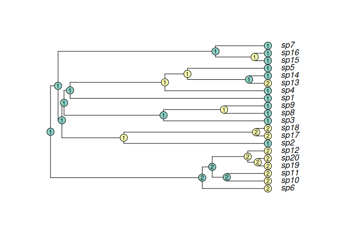

<!-- README.md is generated from README.Rmd. Please edit that file -->

# saasi

<!-- badges: start -->
<!-- badges: end -->

Ancestral state reconstruction method that accounts for variation in
sampling rate among locations.

## Installation

You can install the development version of saasi from
[GitHub](https://github.com/) with:

``` r
# install.packages("remotes")
remotes::install_github("ivansg44/saasi")
```

## Example

``` r
library(saasi)

phy <- readRDS(file.path("data", "two_sampled_states_phy.rds"))
params_df <- readRDS(file.path("data", "two_sampled_states_params_df.rds"))
q_matrix <- readRDS(file.path("data", "two_sampled_states_q_matrix.rds"))

options(scipen = 999)
# Probabilities of each node in `phy` being in state 1 or 2
saasi(phy, params_df, q_matrix, plot = TRUE, cex = 0.75)
```



    #>                   1             2
    #> sp1  1.000000000000 0.00000000000
    #> sp2  1.000000000000 0.00000000000
    #> sp3  1.000000000000 0.00000000000
    #> sp4  1.000000000000 0.00000000000
    #> sp5  1.000000000000 0.00000000000
    #> sp6  0.000000000000 1.00000000000
    #> sp7  1.000000000000 0.00000000000
    #> sp8  1.000000000000 0.00000000000
    #> sp9  1.000000000000 0.00000000000
    #> sp10 0.000000000000 1.00000000000
    #> sp11 0.000000000000 1.00000000000
    #> sp12 0.000000000000 1.00000000000
    #> sp13 0.000000000000 1.00000000000
    #> sp14 1.000000000000 0.00000000000
    #> sp15 1.000000000000 0.00000000000
    #> sp16 1.000000000000 0.00000000000
    #> sp17 0.000000000000 1.00000000000
    #> sp18 0.000000000000 1.00000000000
    #> sp19 0.000000000000 1.00000000000
    #> sp20 0.000000000000 1.00000000000
    #> nd1  0.766149230166 0.23385076983
    #> nd2  0.000327912184 0.99967208782
    #> nd3  0.991987029562 0.00801297044
    #> nd4  0.980989477117 0.01901052288
    #> nd5  0.999193940278 0.00080605972
    #> nd6  0.693824124337 0.30617587566
    #> nd7  0.988864358963 0.01113564104
    #> nd8  0.994248599275 0.00575140072
    #> nd9  0.960463549841 0.03953645016
    #> nd10 0.989883502659 0.01011649734
    #> nd11 0.000011815406 0.99998818459
    #> nd12 0.999382481935 0.00061751807
    #> nd13 0.972268822929 0.02773117707
    #> nd14 0.939138732679 0.06086126732
    #> nd15 0.000234664555 0.99976533545
    #> nd16 0.000463627459 0.99953637254
    #> nd17 0.000028328123 0.99997167188
    #> nd18 0.999983687957 0.00001631204
    #> nd19 0.000007392738 0.99999260726
