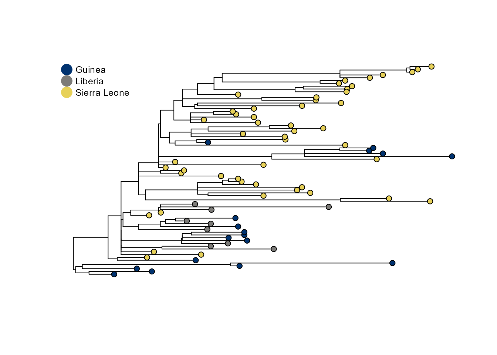

# Sampling-Aware Ancestral State Inference

``` r
library(saasi)
library(diversitree)
library(ape)
library(phytools)
```

## Introduction

This vignette demonstrates how to use the `saasi` package for ancestral
state reconstruction.

SAASI (Sampling-Aware Ancestral State Inference) is an ancestral state
reconstruction method that accounts for variation in sampling rates
among locations or traits.

Unlike traditional methods that assume uniform sampling, SAASI
explicitly models heterogeneous sampling, leading to ancestral state
estimates that take sampling into account.

SAASI is described in Song et al. (2025).

## Installation

You can install the development version of saasi from
[GitHub](https://github.com/MAGPIE-SFU/saasi) with:

``` r
# install.packages("remotes")
remotes::install_github("MAGPIE-SFU/saasi")
```

## Overview

The `saasi` function requires three main inputs:

1.  **A phylogenetic tree** (class `phylo`) that is:

    - Rooted and binary
    - Has branch lengths in units of time (all positive)
    - Contains tip states (`tree$tip.state`) with no missing values

    SAASI has the function
    [`prepare_tree_for_saasi()`](https://magpie-sfu.github.io/saasi/reference/prepare_tree_for_saasi.md)
    which can ensure that these conditions are met.

2.  **Transition rate matrix Q** (class `matrix`):

    - Rates of transition between states

    Use
    [`estimate_transition_rates()`](https://magpie-sfu.github.io/saasi/reference/estimate_transition_rates.md)
    to estimate this matrix.

3.  **Birth-death-sampling parameters** (class `data.frame`):

    - Speciation rate
    - Extinction/removal rate
    - Sampling rate

    Use
    [`estimate_bds_parameters()`](https://magpie-sfu.github.io/saasi/reference/estimate_bds_parameters.md)
    to estimate the speciation rate and a single, overall sampling rate.
    The “extinction rate” (in the language of birth-death models) in
    infectious disease applications is the inverse of the duration of
    infectiousness, i.e. the rate of leaving the infectious class.

The output is a data frame containing the probability of each state for
each internal node of the phylogenetic tree.

## Example: Ebola 2013-2016 West African Ebola Epidemic

### Read tree and load metadata

For this example, we use data from Nextstrain (Hadfield et al. 2018;
Sagulenko, Puller, and Neher 2018):
<https://nextstrain.org/ebola/ebov-2013?c=country>.

``` r
tree <- ape::read.tree(system.file("extdata", "nexstrain_ebola_ebov-2013_smaller.nwk", package = "saasi"))
metadata <- readr::read_tsv(system.file("extdata", "nextstrain_ebola_ebov-2013_metadata.tsv", package = "saasi"))
#> Rows: 1493 Columns: 8
#> ── Column specification ────────────────────────────────────────────────────────
#> Delimiter: "\t"
#> chr  (7): strain, country, division, author, author__url, accession, accessi...
#> date (1): date
#> 
#> ℹ Use `spec()` to retrieve the full column specification for this data.
#> ℹ Specify the column types or set `show_col_types = FALSE` to quiet this message.
```

First, create a data frame containing strains and states. The first
column of the data frame should match `tree$tip.label`, and the second
column should contain the state of interest. Users can skip this step if
`tree$tip.state` already exists.

``` r
tip_data <- data.frame(
  tip_label = metadata$strain,
  state = metadata$country
)
```

### Modify the tree to be compatible with saasi

Users can apply the function
[`prepare_tree_for_saasi()`](https://magpie-sfu.github.io/saasi/reference/prepare_tree_for_saasi.md)
to make the tree compatible with saasi. To check if the tree is
compatible, use the function
[`check_tree_compatibility()`](https://magpie-sfu.github.io/saasi/reference/check_tree_compatibility.md).
Here, the function will include the tip states (i.e. their location) in
the tree as

``` r
ebola_tree <- prepare_tree_for_saasi(tree, tip_data)
```

This tree is a downsampled version of the 2013 Ebola virus tree from
nextstrain. There are 193 tips from three countries.

``` r
plot_saasi(ebola_tree, saasi_result = NULL, tip_cex = 1, res = 900)
```



### Estimating transition rates

Users can estimate the transition rate matrix Q using the function
[`estimate_transition_rates()`](https://magpie-sfu.github.io/saasi/reference/estimate_transition_rates.md).
Users can specify the model for the transition rate matrix: 1. Equal
rate `ER`, 2. Symmetric rate `SYM`, 3. All rates different `ARD`, and or
a custom structure for the matrix.

``` r
Q <- estimate_transition_rates(ebola_tree, method = 'fitMk', matrix_structure = 'SYM')
```

### Estimating speciation and sampling rates

Users can estimate speciation and sampling rates using the function
[`estimate_bds_parameters()`](https://magpie-sfu.github.io/saasi/reference/estimate_bds_parameters.md).
In infectious disease applications, users should have some knowledge
about the expected removal rate ($`1/\mu`$) for the disease of interest,
as saasi requires the extinction rate as an input (to overcome
identifiability limitations). To obtain estimates for the overall
speciation and sampling rates, users should have knowledge about the
maximum and minimum R0, as well as the upper and lower bounds for the
total removal rate $`(1/(\mu+\psi))`$.

For Ebola, we assume the total infectious period $`(1/(\mu+\psi))`$ is
between 20 and 40 days. Converting to years, the total removal rate
($`\mu + \psi`$) is between 9.125 (365/40) and 18.25 (365/20). If we
assume $`\mu = 5`$, this gives us bounds for the overall sampling rate
$`\psi`$ between 4.125 and 13.25. In this example, we assume R0 is
between 1.5 and 3.

``` r
rates <- estimate_bds_parameters(
    ebola_tree,
    mu = 5,
    r0_max = 3,
    r0_min = 1.5,
    psi_max = 15,
    infectious_period_min = 20/365, # convert days to years
    infectious_period_max = 40/365, # convert days to years
    n_starts = 100)
```

Now we set the state-specific sampling and pass the parameters to SAASI.
Our overall sampling rate has been estimated (so as to be comparable
with $`\lambda`$ and $`\mu`$); SAASI allows us to account for
state-specific relative sampling.

Suppose, for example, that Liberia was known to have sequenced a smaller
fraction of the cases than the other states, by a factor of 2.

### Setting up input parameters

``` r
pars = data.frame(state = colnames(Q), lambda=rates$lambda, mu = rates$mu, psi= rates$psi, row.names = NULL)
pars[(pars$state=="Liberia"),"psi"] = pars[(pars$state=="Liberia"), "psi"]/2 # set sampling rate to be 1/2 the baseline
```

### Run saasi analysis

``` r
saasi_ebola <- saasi(ebola_tree, Q, pars)
#> Tree is compatible with SAASI
```

### Plot and save the result

Users can use the built-in function
[`plot_saasi()`](https://magpie-sfu.github.io/saasi/reference/plot_saasi.md)
to visualize results.

``` r
p1 <- plot_saasi(ebola_tree, saasi_ebola, tip_cex = 1, node_cex = 0.5, res = 900)
```


### Compare to equal sampling

If all states had comparable sampling we would obtain a different
ancestral state reconstruction:

``` r
pars = data.frame(state = colnames(Q), lambda=rates$lambda, mu = rates$mu, psi= rates$psi, row.names = NULL)
saasi_ebola2 <- saasi(ebola_tree, Q, pars)
#> Tree is compatible with SAASI

p2 <- plot_saasi(ebola_tree, saasi_ebola2, tip_cex = 1, node_cex = 0.5, res = 900)
```


### Interpreting results

The [`saasi()`](https://magpie-sfu.github.io/saasi/reference/saasi.md)
function returns a data frame with probability distributions over states
for each internal node. Higher probabilities indicate greater confidence
in that ancestral state. In this example, if we assume that Liberia has
sampled at a lower rate than the other two countries, we see more
internal nodes inferred to be in Liberia than if its sampling is the
same as the other locations. This is because SAASI accounts for
undetected cases in Liberia.

Note that Liberia and the factor of 2 are chosen entirely at random for
the purposes of this vignette and do not represent any knowledge or
opinion of the authors about the relative sampling during this outbreak.

Hadfield, James, Colin Megill, Sidney M Bell, John Huddleston, Barney
Potter, Charlton Callender, Pavel Sagulenko, Trevor Bedford, and Richard
A Neher. 2018. “Nextstrain: Real-Time Tracking of Pathogen Evolution.”
*Bioinformatics* 34 (23): 4121–23.
<https://doi.org/10.1093/bioinformatics/bty407>.

Sagulenko, Pavel, Vadim Puller, and Richard A Neher. 2018. “TreeTime:
Maximum-Likelihood Phylodynamic Analysis.” *Virus Evol.* 4 (1).
<https://doi.org/10.1093/ve/vex042>.

Song, Yexuan, Ivan Gill, Ailene MacPherson, and Caroline Colijn. 2025.
“Sampling Aware Ancestral State Inference.” *bioRxiv*, 2025–05.
<https://doi.org/10.1101/2025.05.20.655151>.
