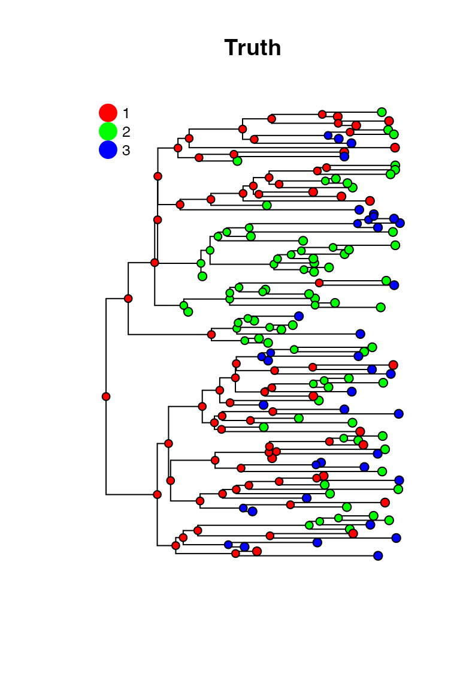
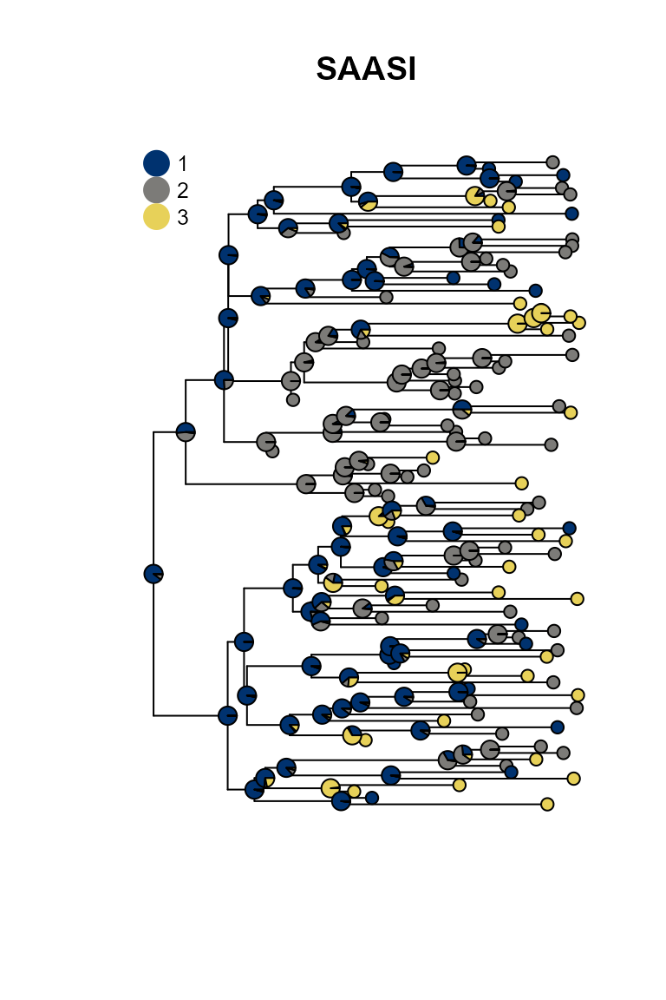
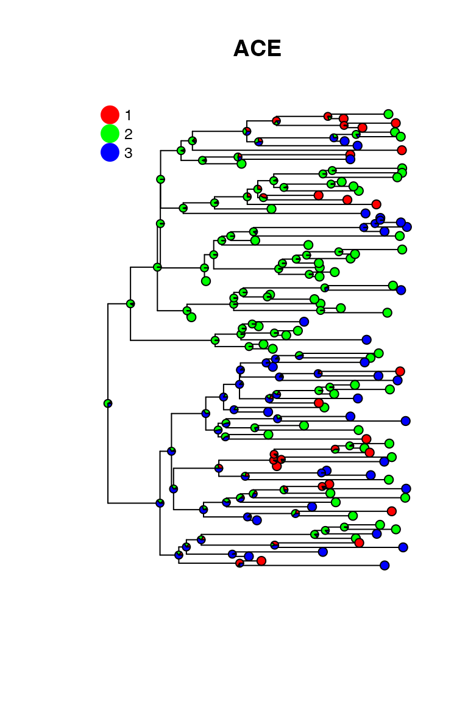

# SAASI Simulation Study

## Introduction

This vignette demonstrates the accuracy of SAASI (Sampling-Aware
Ancestral State Inference) through simulation studies. We simulate
phylogenetic trees with known ancestral states using a
birth-death-sampling process, then assess how well SAASI can recover the
internal states.

## Setup

Load required packages:

``` r

library(saasi)
```

## Simulation Parameters

We use a 3-state model with heterogeneous sampling rates to test SAASI’s
ability to handle sampling bias:

``` r

# Define birth-death-sampling parameters
demo_pars <- data.frame(
  state = c("1", "2", "3"),
  root_prior = c(1/3, 1/3, 1/3),
  lambda = c(3, 1.5, 1.5),        # Birth rate, also varies across states
  mu = c(0.1, 0.1, 0.1),          # Death rate
  psi = c(0.1, 1.0, 1.0)          # Sampling rate (heterogeneous!)
)

# Define transition rate matrix Q
demo_Q <- matrix(0.3, 3, 3)
diag(demo_Q) <- -0.6
rownames(demo_Q) <- c("1", "2", "3")
colnames(demo_Q) <- c("1", "2", "3")
```

**Key feature:** State 1 has a sampling rate of 0.1, while states 2 and
3 have sampling rates of 1.0. This creates sampling bias that SAASI is
designed to handle.

## Single Simulation Example

First, let’s demonstrate a single simulation to understand the workflow:

``` r

set.seed(123)

# Generate tree with built-in post-processing
phy <- sim_bds_tree(
  params_df = demo_pars,
  q_matrix = demo_Q,
  x0 = 1,                    # Start at state 1
  max_taxa = 500,            # Initial tree size
  max_t = 50,                # Maximum time depth
  min_tip = 100              # Minimum tips after post-processing
)
```

Extract true ancestral states (ground truth):

``` r

# The true internal node states are stored in node.state
true_states <- phy$node.state
```

Run SAASI to infer ancestral states:

``` r

# Run SAASI

saasi_result <- saasi(phy = phy,        # phylogenetic tree
                      Q = demo_Q,       # transition rate matrix
                      pars = demo_pars)
```

Calculate accuracy:

``` r

predicted_states <- apply(saasi_result, 1, which.max)

# Calculate accuracy
accuracy <- mean(predicted_states == true_states)
cat("Accuracy for this simulation:", round(accuracy, 3), "\n")
#> Accuracy for this simulation: 0.9
```

## Comparison to ace

In contrast, standard tools are not designed to account for differences
in sampling. Inferring ancestral states with `ace`:

``` r

ace_result = ace(phy$tip.state, phy, type="d")
ace_predictions = apply(ace_result$lik.anc, 1, which.max)
```

Let’s plot the truth, the ace predictions and the saasi predictions:

``` r

true_result = 0*saasi_result
for (k in 1:nrow(true_result)) { true_result[k, true_states[k]] = 1 }
```

``` r

op <- par(mfrow = c(1, 3), mar = c(1, 1, 3, 1), oma = c(0, 0, 0, 0))
on.exit(par(op), add = TRUE)
plot_saasi(phy, true_result, tip_cex = 1, node_cex = 0.6); title("Truth")
plot_saasi(phy, saasi_result, tip_cex = 1, node_cex = 0.6); title("SAASI")
plot_saasi(phy, ace_result$lik.anc, tip_cex = 1, node_cex = 0.6); title("ACE")
```



SAASI is much closer to the truth than ace, because it accounts for
lower sampling in state 1 (red). The consequence of this lower sampling
is that (of course) red tips are less well-represented in the tree than
they are in the process that created the tree. Even if the observed tips
are in states 2 and 3, the internal nodes giving rise to them might well
be in state 1. SAASI correctly estimates many red internal nodes in the
top and bottom portions of the tree, whereas ace’s simpler discrete
trait phylogeography model does not. This is because SAASI’s likelihood
computation accounts for the fact that a clade with a red ancestor is
still likely to have quite a few green and blue tips in it, since these
are sampled at a higher rate than red tips.
